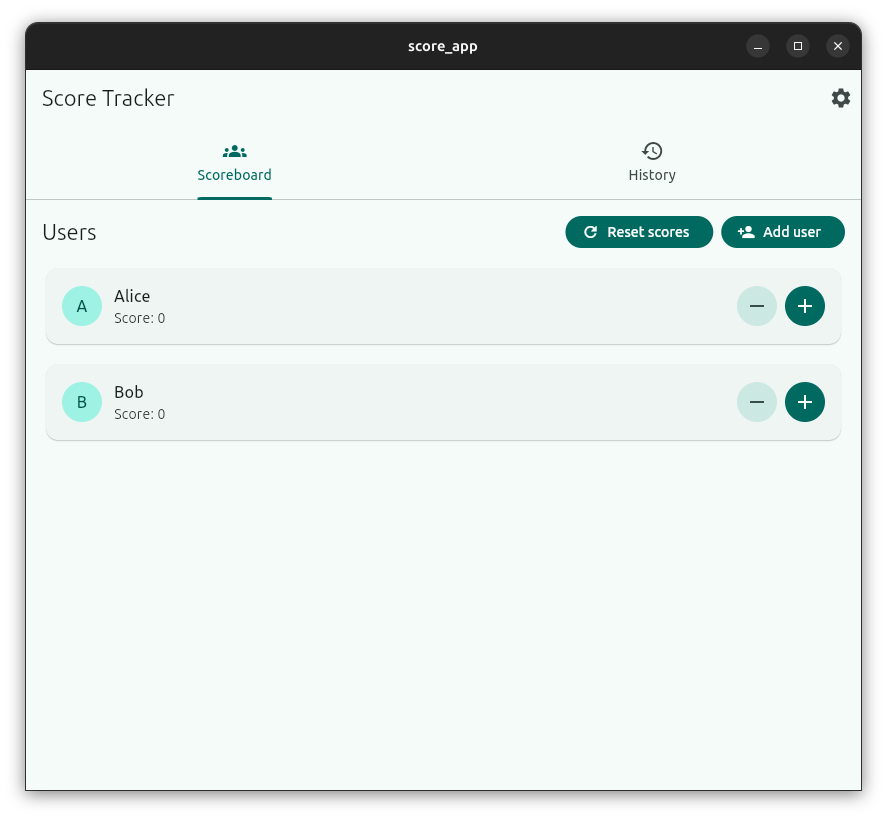
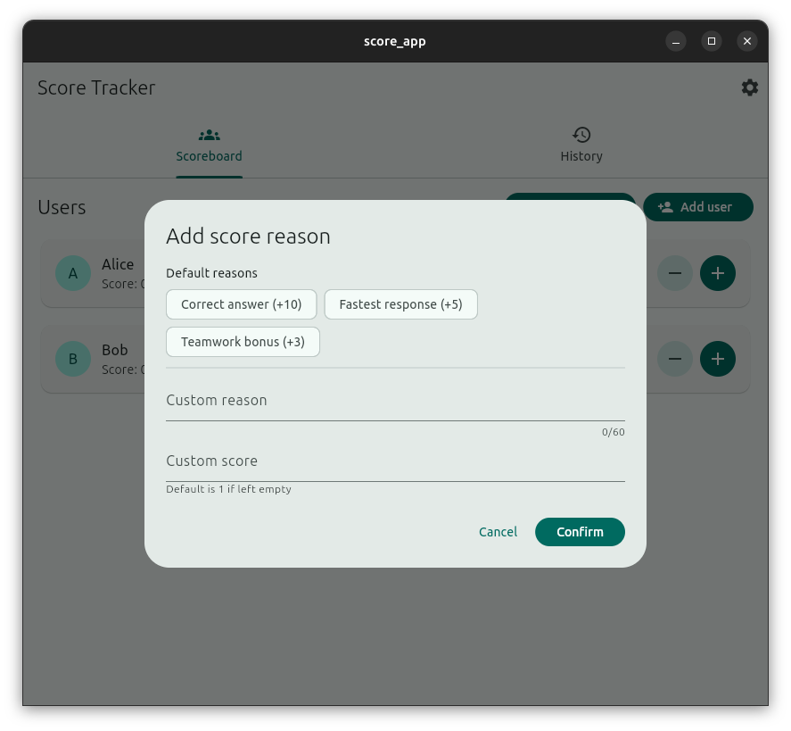
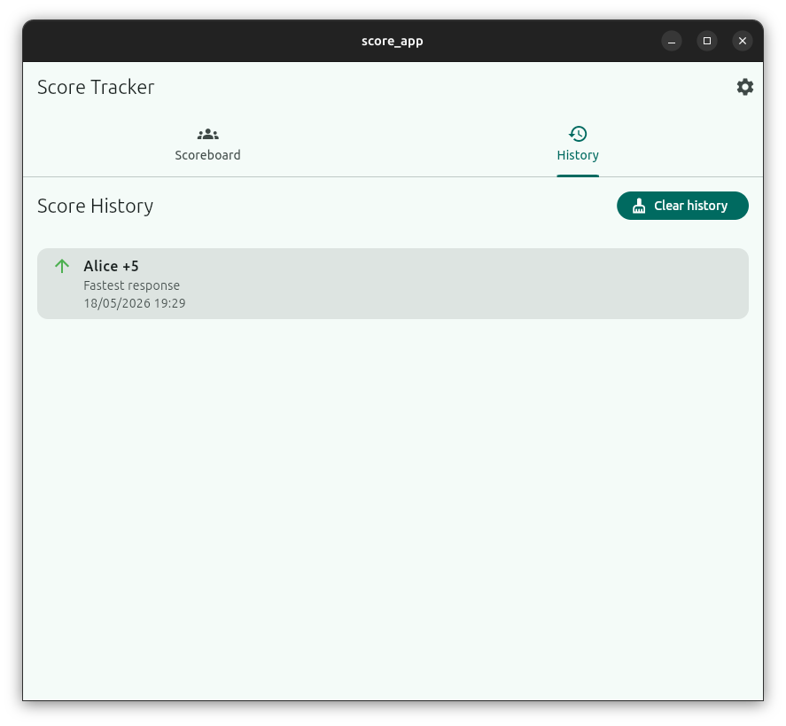
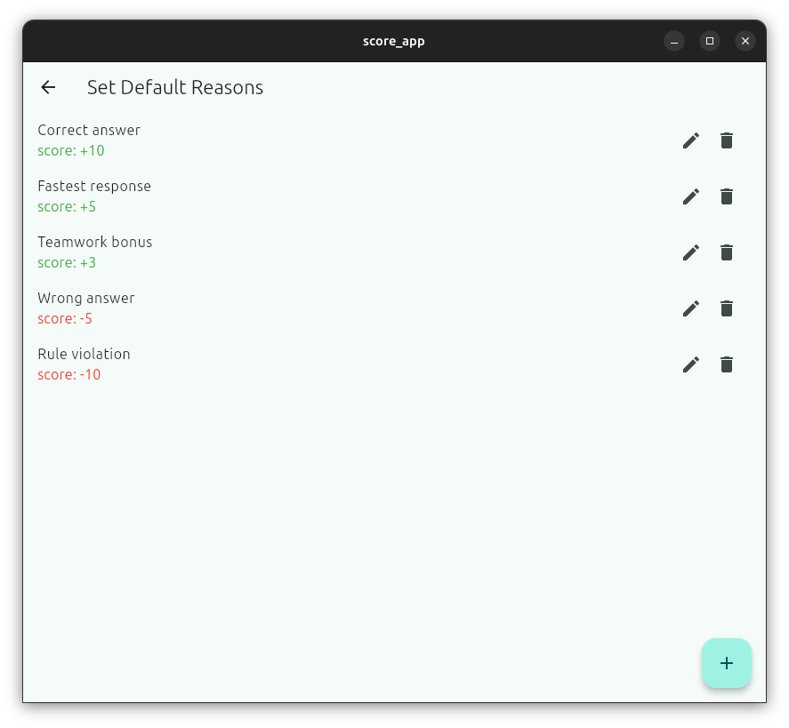

# Score Tracker App

A score app that can mark the reason for score changes, manage the default reasons, and record score history.

It should be able to run on Android, iOS, and desktop. Notice that it does not support web since it uses ObjectBox for data storage, which does not have web support. Also, the development process is focused on android and desktop (windows and linux(ubuntu)), so the UI may not be optimized for iOS and mac.

## install step
1. ensure you have Flutter installed. If not, follow the instructions on the official Flutter website: https://flutter.dev/docs/get-started/install
2. install dependencies (objectbox, cupertino_icons)
```bash
flutter pub get
```
3. run app
```bash
flutter run
```

## build apk
```bash
flutter build apk --release
```

## build desktop app
```bash
flutter build windows --release # for windows
flutter build linux --release # for linux
```

## Credits
- [ObjectBox](https://objectbox.io/) for providing a powerful and efficient database solution
- [IconKitchen](https://icon.kitchen/i/H4sIAAAAAAAAA0VRQU7DMBD8y3KNUEJoAd8QbTkhIeBW9eDE68SSk40cB1pFeRRf4GWsnabNIV6PZ2fG6xG-pR2wBzGCrl7IkgMBNzp-kEBxxdJcPul7xphnTSedD0098gIKtRys50NTUstAX5LDgqRTMAWVz1p2yHhpXGkxinydZuSsFSE8BrW_3yyN3gslRgjAq5PKYDs7e-pi7jSkW-XrzW7LpCzs1s_5ZvsYrGVbsZ_Is1XM8YZ9HXo6Mq3n7v0IRxDp7d0qgdNSzH5X0Sk5sx4WVigurMXswA662tEcT8vGWCbDBxXkKcQnq0B4NyCPyUtrShBa2h65z9fYIJ_Gfbw6j2JwnHyMqu9SKdNWQZivDSLLEnCmqtkqlOzgqZlrizqiEzc2pAYbXnfPg1COjApPRD3_f7CAw_QPzWsGkgACAAA) for creating free icons used in the app

## screenshots
All screenshots are taken on ubuntu desktop

1. main page: shows the current score of all user

2. add score page: shows the form to add score change with reason

3. score history page: shows the history of score changes with reasons

4. default reason setting page: shows the list of default reasons and allows user to add, edit, delete default reasons


## Future improvements
- [ ] CI/CD with [codemagic](https://blog.codemagic.io/getting-started-with-codemagic/)
- [ ] dark mode
- [x] sort user by score
- [ ] chart to compare score between users
- [ ] export score history to csv or excel